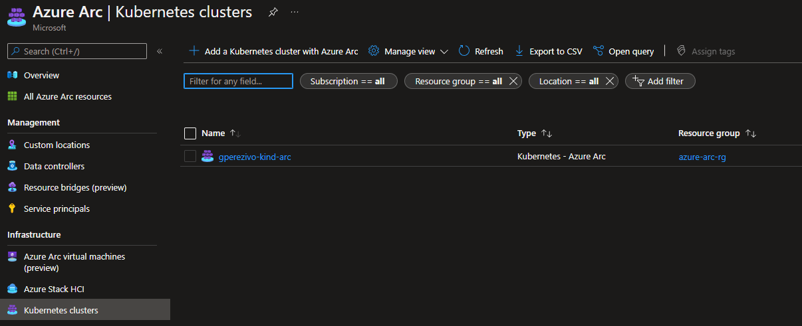
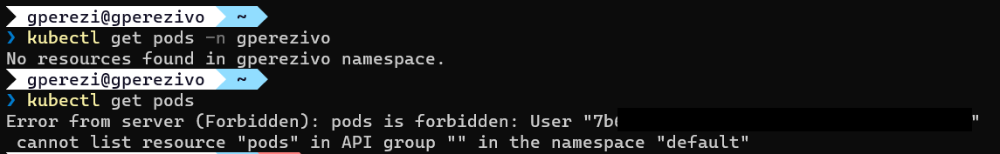

# Azure ARC on Kind k8s Cluster with Azure RBAC 

- [Azure ARC on Kind k8s Cluster with Azure RBAC](#azure-arc-on-kind-k8s-cluster-with-azure-rbac)
  - [Prerequisites](#prerequisites)
  - [Set up your environment](#set-up-your-environment)
  - [Create Kind cluster](#create-kind-cluster)
  - [Connect to your subscription](#connect-to-your-subscription)
  - [Create resource group](#create-resource-group)
  - [Create Azure Arc connected cluster](#create-azure-arc-connected-cluster)
  - [Create Service Principal](#create-service-principal)
  - [Connect to your cluster](#connect-to-your-cluster)
  - [Connect to your cluster from remote location](#connect-to-your-cluster-from-remote-location)
  - [Test permissions](#test-permissions)
  - [Delete resources](#delete-resources)
## Prerequisites
- Install [Kind](https://kind.sigs.k8s.io)
- Install [Azure CLI](https://docs.microsoft.com/en-us/cli/azure/install-azure-cli?view=azure-cli-latest)
  - Install `connectedk8s` extension (version 1.2.0 or later)
- An Azure tenant with:
  - Permissions to grant _"Sign in and read user profile"_ API permissions to an application (or you can convince your tenant admin to do it)
  - Permission to create a resource group or Contributor role assignment to an resource group


## Set up your environment

Create `variables.sh` file on your repository root directory.

_If you fork this repository `variables.sh` is included in .gitignore file_

```bash
#!/bin/bash
#CLUSTER CONFIGURATION
TENANT_ID=
SUBSCRIPTION_ID=
RESOURCE_GROUP=
CLUSTER_NAME=
#If you want to use Azure Arc preview features like Service plans, you need to set the location to "westeurope" or "eastus"
LOCATION=

#Kubernetes RBAC Configuration
#Used to grant full permissions on a k8s namespace to AAD user or group 
NAMESPACE=
USER_ID=
GROUP_ID=
```

and grant execution permissions to `variables.sh` file:

```bash
chmod +x variables.sh
```


## Create Kind cluster

The Kind cluster name and Azure Arc connected cluster will be the same in this example.

If you have a cluster already created, you can use it and avoid this step.
If you don't have a cluster, you can create one with the following script:

```bash
./create-kind-cluster.sh
```
> Output:
> ```
>Creating cluster "gperezivo-kind-arc" ...
> ✓ Ensuring node image (kindest/node:v1.23.4) 🖼 
> ✓ Preparing nodes 📦  
> ✓ Writing configuration 📜 
> ✓ Starting control-plane 🕹️ 
> ✓ Installing CNI 🔌 
> ✓ Installing StorageClass 💾 
>Set kubectl context to "kind-gperezivo-kind-arc"
>You can now use your cluster with:
>
>kubectl cluster-info --context kind-gperezivo-kind-arc
>
>Not sure what to do next? 😅  Check out https://kind.sigs.k8s.io/docs/user/quick-start/
>```
>`create-kind-cluster.sh content`
>```bash
>#!/bin/bash
>. ./variables.sh
> # Create kind cluster
> kind create cluster --config ./cluster-config.yml --name $CLUSTER_NAME
>```


After the cluster is created, check if your current context in the kubectl is the cluster you just created.

```bash
kubectl config get-contexts
```
> Output:
> ```
> CURRENT   NAME                      CLUSTER                   AUTHINFO                  NAMESPACE
>*         kind-gperezivo-kind-arc   kind-gperezivo-kind-arc   kind-gperezivo-kind-arc   
>```

## Connect to your subscription

If you aren't connected to your subscription, you can do it with the following command:

```bash
./connect-az-cli.sh
```
This script will output your selected subscription information.

>`connect-az-cli.sh content`
>```bash 
>#!/bin/bash
>. ./variables.sh
>az logout
>az login --output none
>az account set --subscription $SUBSCRIPTION_ID --output none
>az account show
>```

## Create resource group

If you don't have a resource group created, you can create one with the following command:

```bash
az group create --name $RESOURCE_GROUP --location $LOCATION 
```

## Create Azure Arc connected cluster

Now we will create the Azure Arc connected cluster using the script

```bash
./connect-arc.sh
```

>`connect-arc.sh content`
>```bash
>#!/bin/bash
>. ./variables.sh
>az extension add --name connectedk8s
>az connectedk8s connect --resource-group $RESOURCE_GROUP --name $CLUSTER_NAME --subscription $SUBSCRIPTION_ID --location $LOCATION
>```

After the script ends, check if your cluster is connected to Azure Arc.





## Create Service Principal

We need a service principal with permissions to read authorization data.

First of all we need to define a custom role to check if the user making the request is authorized

```json
{
  "Name": "Read authorization",
  "IsCustom": true,
  "Description": "Read authorization",
  "Actions": ["Microsoft.Authorization/*/read"],
  "NotActions": [],
  "DataActions": [],
  "NotDataActions": [],
  "AssignableScopes": [
    "/subscriptions/<subscriptionId>"
  ]
}
```


After saving that role definition on `acessCheck.json` file, we can create the service principal with the following script:


```bash
./create-service-principal.sh
```
> `create-service-principal.sh content`
> ```bash
> #!/bin/bash
>. ./variables.sh
>#https://docs.microsoft.com/en-us/azure/azure-arc/kubernetes/>azure-rbac
>
>#Create a server application
>SERVER_APP_ID=$(az ad app create --display-name "${CLUSTER_NAME}Server" --identifier-uris "api://$TENANT_ID/ARC-KIND-SERVER" --query appId -o tsv)
>az ad app update --id "${SERVER_APP_ID}" --set groupMembershipClaims=All
>az ad sp create --id "${SERVER_APP_ID}"
>
>#Get new credentials
>SERVER_APP_SECRET=$(az ad sp credential reset --name "${SERVER_APP_ID}" --credential-description "ArcSecret" --query password -o tsv)
>
>#Grant permissions (An Azure tenant admin has to run this command)
>az ad app permission add --id "${SERVER_APP_ID}" --api 00000003-0000-0000-c000-000000000000 --api-permissions e1fe6dd8-ba31-4d61-89e7-88639da4683d=Scope
>#An Azure tenant admin has to run this command
>az ad app permission grant --id "${SERVER_APP_ID}" --api 00000003-0000-0000-c000-000000000000
>
>
>#Create a role assignment for the server application
>#https://docs.microsoft.com/en-us/azure/azure-arc/kubernetes/azure-rbac#create-a-role-assignment-for-the-server-application
>ROLE_ID=$(az role definition create --role-definition ./accessCheck.json --query id -o tsv)
>az role assignment create --role "${ROLE_ID}" --assignee "${SERVER_APP_ID}" --scope "/subscriptions/$SUBSCRIPTION_ID"
>
>
>#Enable Azure RBAC on the cluster
>az connectedk8s enable-features -n $CLUSTER_NAME -g $RESOURCE_GROUP  --features azure-rbac --app-id "${SERVER_APP_ID}" --app-secret "${SERVER_APP_SECRET}"
>```
>
> ### __An Azure tenant administrator__ has to run the __az ad app permission__ commands.


## Connect to your cluster

In order to connect using kubectl form a remote location, you need to enable the [`cluster-connect`](https://docs.microsoft.com/en-us/azure/azure-arc/kubernetes/cluster-connect) feature: 
```bash
az connectedk8s enable-features --features cluster-connect -n $CLUSTER_NAME -g $RESOURCE_GROUP
```


At this point you have a cluster connected to Azure Arc with Azure RBAC enabled.

You will need create role assignments for your AAD users or groups.
Check the [Build-in roles](https://docs.microsoft.com/en-us/azure/azure-arc/kubernetes/azure-rbac#built-in-roles).

In my case I want to grant Writer role to a user on the namespace `gperezivo`. If the namespace doesnt exist, create it using kubetl locally.


```bash
CLUSTER_ID=$(az connectedk8s show --resource-group $RESOURCE_GROUP --name $CLUSTER_NAME --query id -o tsv)

az role assignment create --role "Azure Arc Kubernetes Writer" --assignee $USER_ID --scope $CLUSTER_ID
```

After creating the role assignment, we need to create Kubernetes RBAC assignment to grant permissions on the namespace in the cluster.

```yaml
kind: Role
apiVersion: rbac.authorization.k8s.io/v1
metadata:
  name: dev-user-full-access
  namespace: $NAMESPACE
rules:
- apiGroups: ["", "extensions", "apps"]
  resources: ["*"]
  verbs: ["*"]
- apiGroups: ["batch"]
  resources:
  - jobs
  - cronjobs
  verbs: ["*"]
---
kind: RoleBinding
apiVersion: rbac.authorization.k8s.io/v1
metadata:
  name: dev-user-access
  namespace: $NAMESPACE
roleRef:
  apiGroup: rbac.authorization.k8s.io
  kind: Role
  name: dev-user-full-access
subjects:
- kind: User
  namespace: $NAMESPACE
  name: $USER_ID
```


> Use `parse-kubectl.sh` script to replace bash variables into the yaml file.
> 
> If you want to create a rolebinding with a group, use `role-group-binding-template.yml` instead of `role-user-binding-template.yml`

```bash 
./parse-kubectl.sh ./role-user-binding-template.yml | kubectl apply -f -
```

## Connect to your cluster from remote location
```bash
az connectedk8s proxy --resource-group $RESOURCE_GROUP --name $CLUSTER_NAME
```


## Test permissions


## Delete resources

```bash
az role assignment delete --role $ROLE_ID --assignee $SERVER_APP_ID

az connectedk8s delete --resource-group $RESOURCE_GROUP --name $CLUSTER_NAME
az ad sp delete --id $SERVER_APP_ID

az role definition delete --name "Read authorization" --custom-role-only

kind delete cluster --name $CLUSTER_NAME
```
